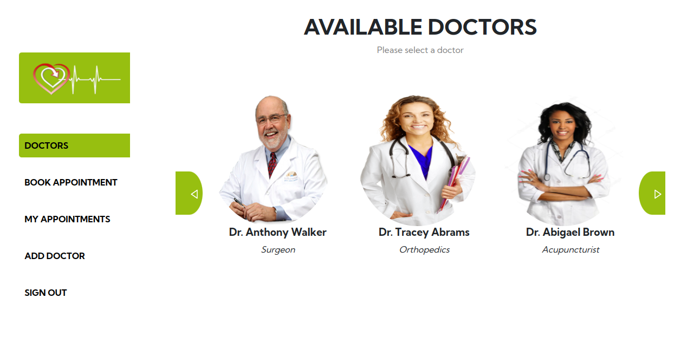

<a name="readme-top"></a>

<div align="center">
  
  <br/>

  <h3><b>Doctor's Appointment</b></h3>

</div>

<!-- TABLE OF CONTENTS -->

# 📗 Table of Contents

- [📖 About the Project](#about-project)
  - [🛠 Built With](#built-with)
    - [Tech Stack](#tech-stack)
    - [Key Features](#key-features)
    - [Preview](#preview)
  - [🚀 Live Demo](#live-demo)
- [💻 Getting Started](#getting-started)
  - [Setup](#setup)
  - [Prerequisites](#prerequisites)
  - [Install](#install)
  - [Usage](#usage)
  - [Link to Backend](#link-to-backend)
  - [Link to kanban board](#link-to-kanban-board)
  - [Deployment](#deployment)
- [👥 Authors](#authors)
- [🤝 Contributing](#contributing)
- [⭐️ Show your support](#support)
- [🙏 Acknowledgements](#acknowledgements)
- [❓ FAQ](#faq)
- [📝 License](#license)

<!-- PROJECT DESCRIPTION -->

# 📖 [Doctor's Appointment] <a name="about-project"></a>

**Doctor's Appointment** is a real-world practical app that allows a user to log into the site and view the available doctors in order to make an appointment. The user can also view the details of the doctor and make an appointment by providing the specific date and time as well as the description/nature of the appointment. Moreover, the user can view the list of appointments that he/she has made. Functionality is also provided for the user to delete/cancel an appointment.

## 🛠 Built With <a name="built-with"></a>

### Tech Stack <a name="tech-stack"></a>

<details>
  <summary>Client</summary>
  <ul>
    <li><a href="https://reactjs.org/">React.js</a></li>
  </ul>
</details>

<details>
  <summary>Server</summary>
  <ul>
    <li><a href="https://rubyonrails.org/">Ruby on Rails</a></li>
  </ul>
</details>

<details>
<summary>Database</summary>
  <ul>
    <li><a href="https://www.postgresql.org/">PostgreSQL</a></li>
  </ul>
</details>


<!-- Features -->

### Key Features <a name="key-features"></a>

- **[Logs in the User using the username]**
- **[Presents a list of available doctors]**
- **[Lets the user view the details of a doctor]**
- **[Lets the user book doctors' appointments]**
- **[Lets the user view all appointments]**

<!-- Preview -->

### Preview <a name="preview"></a>

<div align="center">
  
</div>

<p align="right">(<a href="#readme-top">back to top</a>)</p>


<!-- LIVE DEMO -->

## 🚀 Live Demo <a name="live-demo"></a>

- [Live Demo Link](https://doc-appointments.netlify.app/)

<p align="right">(<a href="#readme-top">back to top</a>)</p>

<!-- GETTING STARTED -->

## 💻 Getting Started <a name="getting-started"></a>

To get a local copy up and running, follow these steps.

### Prerequisites

In order to run this project you need:

```sh
- git
- node
```

### Setup

Clone this repository to your desired folder:

```bash
$ git clone https://github.com/TracK92/doctor-appointment-front-end.git
```


### Install

Install this project with:

```bash
  cd doctor-appointment-front-end
  npm install
```

### Usage

To run the project, execute the following command:

```sh
  npm run start
```

### Link to Backend

- [Link to Backend (API)](https://github.com/TracK92/doctor-appointment-api.git)

### Link to kanban board

- [Link to kanban board](https://github.com/users/TracK92/projects/9)

### Deployment

You can deploy the project to Netlify by following these steps:

- Create a new site on Netlify
- Select your repository
- Select the branch to deploy
- Set the build command to `npm run build`
- Set the publish directory to `build`
- Click on deploy

<p align="right">(<a href="#readme-top">back to top</a>)</p>

<!-- AUTHORS -->

## Authors

👤 **Tracey Kadenyi**

- GitHub: [@TracK92](https://github.com/TracK92)
- LinkedIn: [@Tracey Kadenyi](https://www.linkedin.com/in/Tracey-Kadenyi/)
- Twitter: [@traci_K7](https://twitter.com/traci_k7)

👤 **Aleksandra Ujvari**

- GitHub: [@digia3d](https://github.com/digia3d)
- LinkedIn: [Aleksandra (Alex) Ujvari](https://www.linkedin.com/in/aleksandraujvari/) 
- Twitter: [@ujvari65](https://twitter.com/ujvari65)

👤 **Abby Nyakara**

- GitHub: [@AbbyNyakara](https://github.com/AbbyNyakara)
- Twitter: [@AbigaelNyakara](https://twitter.com/AbbyNyakara)
- LinkedIn: [Abigael Nyakara](https://linkedin.com/in/AbbyNyakara)

👤 **Brahim didi**

- GitHub: [@brahimdidi](https://github.com/brahimdidi)
- Twitter: [@brahimdidi](https://twitter.com/twitterhandle)
- LinkedIn: [@brahimdidi](https://linkedin.com/in/brahimdidi)

<!-- CONTRIBUTING -->

## 🤝 Contributing <a name="contributing"></a>

Contributions, issues, and feature requests are welcome!

Feel free to check the [issues page](../../issues/).

<p align="right">(<a href="#readme-top">back to top</a>)</p>

<!-- SUPPORT -->

## ⭐️ Show your support <a name="support"></a>

Give a ⭐️ if you like this project!

<p align="right">(<a href="#readme-top">back to top</a>)</p>

<!-- ACKNOWLEDGEMENTS -->

## 🙏 Acknowledgments <a name="acknowledgements"></a>

- Original design idea by [Murat Korkmaz on Behance](https://www.behance.net/muratk)

<p align="right">(<a href="#readme-top">back to top</a>)</p>

<!-- FAQ (optional) -->

## 📝 FAQ <a name="faq"></a>

- **How can I contact you?** <br />
  You can contact any of the authors of this project via their LinkedIn or Twitter accounts as listed above.

- **How can I contribute?** <br />
  You can contribute by opening issues or pull requests.

- **How can I report a bug?** <br />
  You can report bugs by opening an issue.

- **How can I request a feature?** <br />
  You can request a feature by opening an issue.


<p align="right">(<a href="#readme-top">back to top</a>)</p>

<!-- LICENSE -->

## 📝 License <a name="license"></a>

This project is [MIT](./MIT.md) licensed.

<p align="right">(<a href="#readme-top">back to top</a>)</p>


